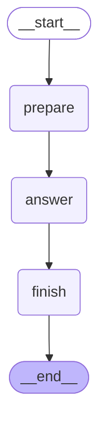

# Day 12 - First LangGraph StateGraph

## Goal

Convert the manually controlled structured agent
workflow from Day 11 into a LangGraph StateGraph.

## Architecture

START
  ↓
prepare
  ↓
answer
  ↓
finish
  ↓
END

## State

AgentState contains:

- question
- answer
- step
- status
- trace

## Graph

## What I Learned

1. StateGraph defines a stateful workflow.

2. Nodes are normal Python functions that read
   agent state and return state updates.

3. Edges determine which node executes next.

4. START is the graph entry point.

5. END is the graph exit point.

6. compile() converts the graph definition into
   an executable graph.

7. invoke() runs the compiled graph with an
   initial state.

8. LangGraph manages the workflow while
   AgentState carries the data.

9. A node does not need to return the complete
   state. It can return only the fields that
   changed.

## Tests

- [x] graph executes prepare → answer → finish
- [x] trace matches the graph execution path
- [x] LLM answer travels through AgentState
- [x] empty input does not execute the graph

Langraph version tested:
1.2.11

