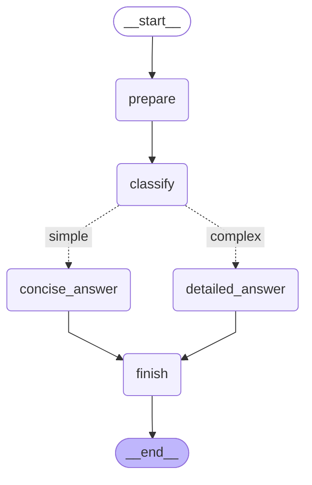

# Day 13 - LangGraph Conditional Routing

## Goal

Use LangGraph conditional edges to route
different questions through different nodes.

## Architecture

START
→ prepare
→ classify
  ├→ concise_answer
  └→ detailed_answer
→ finish
→ END

## State

AgentState contains:

- question
- answer
- step
- status
- route
- trace

## What I Learned

1. A normal edge always goes to the same node.

2. A conditional edge chooses the next node
   based on state.

3. A node performs work and may update state.

4. A router reads state and selects a path.

5. add_conditional_edges() connects a router
   decision to different destination nodes.

6. Different graph branches can later merge
   into the same node.

7. Only the selected branch executes during
   one graph invocation.

8. Deterministic routing is useful for learning
   and testing before using an LLM as a router.

## Tests

- [x] simple question uses concise_answer
- [x] complex question uses detailed_answer
- [x] only one branch executes per invocation
- [x] empty input does not execute the graph

## graph

